<div align="center">

# 🧠 Code Context Recorder

### *Never Lose the WHY Behind Your Code Again*


[🚀 Quick Start](#-quick-start) • [📖 Documentation](#-features) • [🎯 Demo](#-see-it-in-action) • [💬 Community](#-community)

---


</div>

---

## 💥 The Problem

<table>
<tr>
<td width="50%">

**Ever experienced this?** 🤔

```diff
- "Why did we do it this way?"
- "Who wrote this and why??"
- "What was the reasoning here?"
- Lost critical context forever
- Hours debugging old code
- New devs can't understand decisions
```

</td>
<td width="50%">

**Git tracks *WHAT* changed**  
**Comments explain *HOW* it works**  
**But nothing captures *WHY***

<br/>

> *"The most valuable code isn't the code itself—it's the context around it."*

</td>
</tr>
</table>

---

## ✨ The Solution

Code Context Recorder is your **team's knowledge time machine** ⏰

Automatically captures and preserves the complete story behind your code:

<div align="center">

| Feature | Description | Status |
|---------|-------------|--------|
| 📚 **Research Tracking** | Links to Stack Overflow, docs, GitHub issues you referenced | ✅ Ready |
| 💬 **Decision History** | Associated Slack threads, meeting notes, bug tickets | ✅ Ready |
| 🎤 **Voice Notes** | Audio explanations of tricky decisions | 🚧 Coming Soon |
| ⏱️ **Timeline View** | Replay the entire decision-making process | ✅ Ready |
| 🔍 **AI Search** | Find context using natural language | ✅ Ready |
| 👥 **Team Sync** | Share context across your entire team | 🚧 Coming Soon |

</div>

---

## 🎯 See It In Action

### 🎬 Adding Context to Your Code

```mermaid
graph LR
    A[🖊️ You Write Code] --> B[🤔 Add Context]
    B --> C[💾 Auto-Saved]
    C --> D[🔍 Searchable Forever]
    D --> E[👥 Team Knowledge]
    
    style A fill:#4CAF50,stroke:#2E7D32,color:#fff
    style B fill:#2196F3,stroke:#1565C0,color:#fff
    style C fill:#FF9800,stroke:#E65100,color:#fff
    style D fill:#9C27B0,stroke:#6A1B9A,color:#fff
    style E fill:#F44336,stroke:#C62828,color:#fff
```

<div align="center">



</div>

<table>
<tr>
<td width="50%">

### 📝 Before CCR
```javascript
// TODO: Fix this later
function calculatePrice(items) {
  return items.reduce((a,b) => 
    a + b.price * 0.87, 0);
}
```
*Why 0.87? Nobody knows anymore* 😰

</td>
<td width="50%">

### ✅ With CCR
```javascript
// Context: Using 0.87 multiplier for bulk discount
// Decision: After meeting with sales team
// Ticket: JIRA-1234
function calculatePrice(items) {
  return items.reduce((a,b) => 
    a + b.price * 0.87, 0);
}
```
*Full context preserved forever* 🎉

</td>
</tr>
</table>

### 🎥 Live Demo

<div align="center">

**[Open Interactive Demo](demo.html)** — Try Code Context Recorder in your browser

</div>

---

## 🚀 Quick Start

### Installation is a breeze! Choose your path:

<details open>
<summary><b>🎨 VS Code Extension (Recommended)</b></summary>

```bash
# Install from VS Code Marketplace (Coming Soon)
code --install-extension code-context-recorder

# Or install from source
git clone https://github.com/koushik4475/code-context-recorder.git
cd code-context-recorder
npm install
npm run build
cd packages/vscode-extension
npm run install-extension
```
*On Windows PowerShell use `;` instead of `&&` between commands, or run each line separately.*

**Keyboard Shortcuts:**
- `Ctrl+Shift+C` - Add context
- `Ctrl+Shift+T` - View timeline
- `Ctrl+Shift+F` - Search contexts
- `Ctrl+Shift+V` - Voice note (coming soon)

</details>

<details>
<summary><b>💻 CLI Tool</b></summary>

```bash
# Install globally
npm install -g @ccr/cli

# Or use in your project
npm install --save-dev @ccr/cli

# Initialize in your project
ccr init
```

</details>

<details>
<summary><b>🔗 Git Hooks</b></summary>

```bash
# Automatically prompt for context on commits
cd your-project
npx ccr-hooks install
```

</details>

---

## 🎨 Features

<div align="center">

### 🔥 Core Capabilities

</div>

<table>
<tr>
<td width="33%" align="center">

### 📊 Smart Timeline


View complete decision history for any file with beautiful visual timeline

</td>
<td width="33%" align="center">

### 🎯 Instant Search


Find context using natural language queries in milliseconds

</td>
<td width="33%" align="center">

### 🔄 Auto-Capture


Automatically links browser research to your commits

</td>
</tr>
</table>

### 💡 Usage Examples

<details>
<summary><b>📝 Recording Context</b></summary>

```bash
# Add context to current file
ccr add "Chose this approach because X API was deprecated" --file src/auth.ts

# Add context with links
ccr add "Following this pattern: https://..." --file src/auth.ts

# Record important decisions (use add with a clear message)
ccr add "Decision: Use PostgreSQL over MongoDB. Need ACID transactions for financial data." --file src/db.ts --tags "decision,architecture"
```

</details>

<details>
<summary><b>🔍 Searching Context</b></summary>

```bash
# Natural language search
ccr search "why did we choose PostgreSQL over MongoDB"

# Search by file pattern
ccr search "authentication" --file "*.ts"

# Search by type
ccr search "decision" --type decision
```

</details>

<details>
<summary><b>📈 View Analytics</b></summary>

```bash
# Show project statistics
ccr stats

# Output:
# 📊 Total Contexts: 247
# 📈 Avg per Commit: 2.3
# 🔥 Most Documented Files:
#    ├─ src/auth.ts (45)
#    ├─ src/api.ts (32)
#    └─ src/utils.ts (28)
```

</details>

<details>
<summary><b>⏱️ View Timeline</b></summary>

```bash
# See complete history for a file
ccr timeline src/components/Auth.tsx
ccr timeline src/api.ts
```

</details>

---

## 🏗️ Architecture

<div align="center">


</div>

### 📦 Project Structure

```
code-context-recorder/
├── 🎯 packages/
│   ├── core/              # TypeScript core library
│   ├── vscode-extension/  # VS Code integration
│   ├── cli/               # Command-line interface
│   ├── git-hooks/         # Git integration
│   ├── browser-extension/ # Browser tracking
│   └── web-viewer/        # React web UI
├── 📖 docs/               # Documentation
└── 🧪 tests/              # Test suites
```

---

## 🎨 Tech Stack

<div align="center">


</div>

<table>
<tr>
<td>

**Core**
- TypeScript (Strict Mode)
- Node.js
- SQLite (better-sqlite3)

</td>
<td>

**Search**
- MiniSearch
- Full-text indexing
- Fuzzy matching

</td>
<td>

**UI**
- VS Code Extension API
- React + TailwindCSS
- WebExtensions API

</td>
</tr>
</table>

---

## 📊 Configuration

Create `.ccrrc.json` in your project root:

```json
{
  "storage": {
    "type": "sqlite",
    "path": ".ccr"
  },
  "capture": {
    "autoCapture": true,
    "includeBrowserHistory": true,
    "includeVoiceNotes": true
  },
  "integrations": {
    "slack": { "enabled": false },
    "linear": { "enabled": false },
    "jira": { "enabled": false }
  },
  "privacy": {
    "excludePatterns": ["*.env", "*.key", "secrets/*"],
    "localOnly": true
  }
}
```

---

## 🗺️ Roadmap

<div align="center">

### Where We're Going 🚀

</div>


<details>
<summary><b>✅ Completed</b></summary>

- [x] Core storage and API
- [x] SQLite integration with WAL mode
- [x] VS Code extension MVP
- [x] Git hooks integration
- [x] Full-text search engine
- [x] Timeline visualization
- [x] CLI tool
- [x] Analytics dashboard

</details>

<details>
<summary><b>🚧 In Progress</b></summary>

- [ ] Voice note recording (60% complete)
- [ ] Browser extension (40% complete)
- [ ] Web viewer UI (30% complete)

</details>

<details>
<summary><b>🔮 Coming Soon</b></summary>

- [ ] Team collaboration features
- [ ] Slack/Linear/Jira integrations
- [ ] AI-powered context suggestions
- [ ] Semantic search improvements
- [ ] Mobile app for viewing context
- [ ] Real-time sync
- [ ] Cloud backup (optional)

</details>

---

## 🤝 Contributing

We ❤️ contributions! Check out our [Contributing Guide](CONTRIBUTING.md)

<div align="center">

### 🌟 Contributors

<a href="https://github.com/koushik4475/code-context-recorder/graphs/contributors">
  
</a>

*Made with [contrib.rocks](https://contrib.rocks)*

</div>

### Development Setup

```bash
# Clone the repository
git clone https://github.com/koushik4475/code-context-recorder.git
cd code-context-recorder

# Install dependencies
npm install

# Run in development mode
npm run dev

# Run tests
npm test

# Build all packages
npm run build
```

---

## 📚 Documentation

<table>
<tr>
<td align="center">

### 📖 [Usage Guide](USAGE.md)
Learn how to use CCR effectively

</td>
<td align="center">

### 🏗️ [Architecture](ARCHITECTURE.md)
Technical deep-dive

</td>
<td align="center">

### 🤝 [Contributing](CONTRIBUTING.md)
Join the community

</td>
</tr>
</table>

---

## 🌟 Why Use Code Context Recorder?

<table>
<tr>
<td width="50%">

### 🎯 For Individual Developers

✅ Never forget why you wrote something  
✅ Resume work instantly after breaks  
✅ Build a knowledge base of your decisions  
✅ Improve code review quality  
✅ Learn from your past choices

</td>
<td width="50%">

### 👥 For Teams

✅ Onboard new developers 10x faster  
✅ Preserve institutional knowledge  
✅ Reduce time debugging legacy code  
✅ Improve team communication  
✅ Create living documentation

</td>
</tr>
</table>

---

## 💬 Community

<div align="center">

[](https://discord.gg/ccr)
[](https://twitter.com/codecontextrec)
[](https://github.com/koushik4475/code-context-recorder/discussions)

</div>

- 💬 [Discord Server](https://discord.gg/ccr) - Get help and chat
- 🐛 [Issue Tracker](https://github.com/koushik4475/code-context-recorder/issues) - Report bugs
- 💡 [Discussions](https://github.com/koushik4475/code-context-recorder/discussions) - Share ideas
- 📧 Email: hello@code-context-recorder.dev

---

## 📄 License

Code Context Recorder is [MIT licensed](LICENSE).

---

## 🙏 Acknowledgments

Built with ❤️ by developers who are tired of losing context.

Special thanks to:
- The amazing open-source community
- Early adopters and beta testers
- All contributors who made this possible

---

<div align="center">

### ⭐ Star us on GitHub — it motivates us a lot!

[](https://star-history.com/#koushik4475/code-context-recorder&Date)

---

**[⬆ Back to Top](#-code-context-recorder)**

</div>
